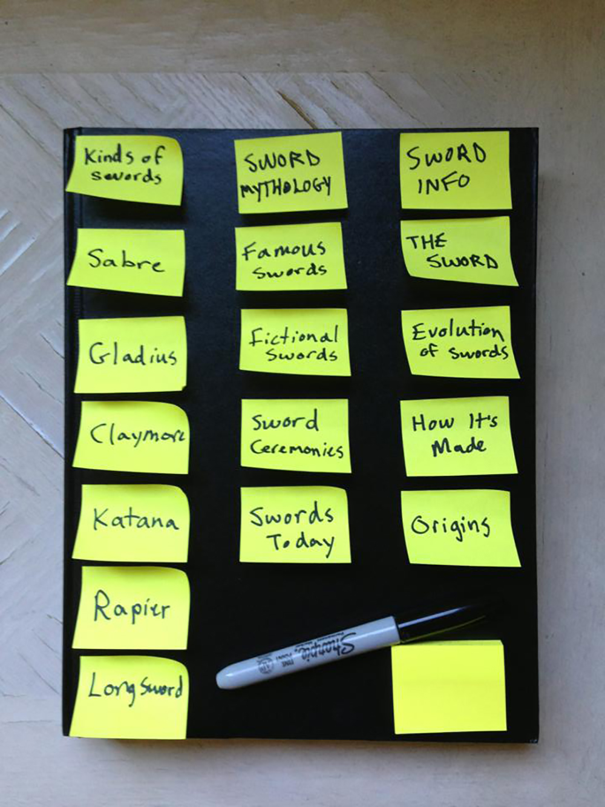
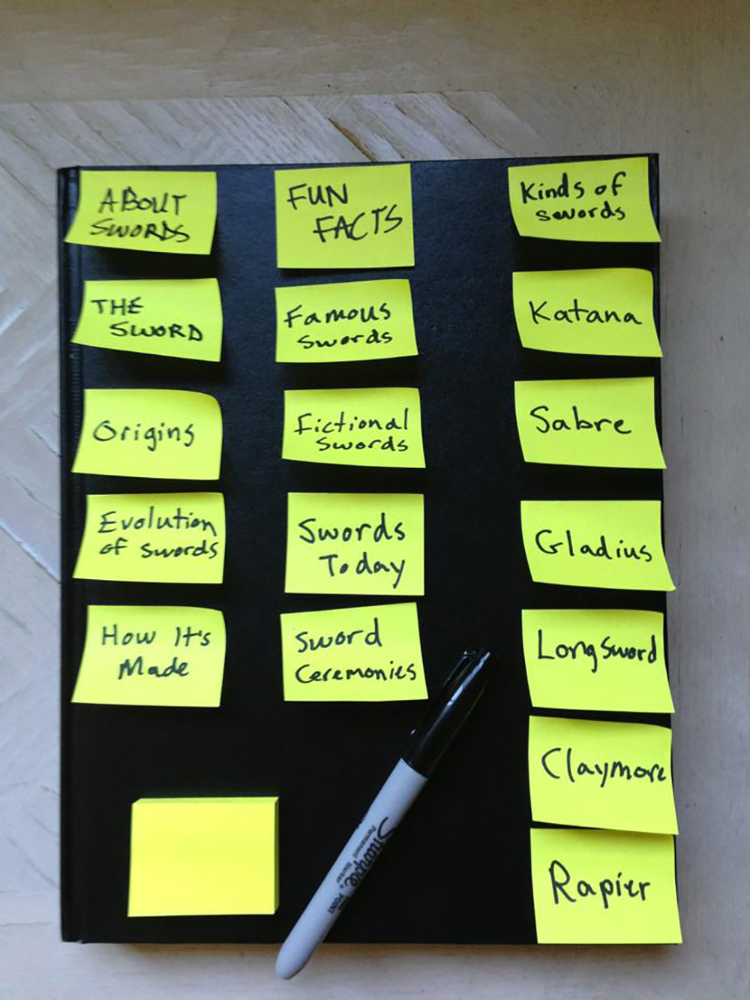

# Card sort report

The purpose of this card sort was to determine common navigation patterns and categories from the content of {your large data-oriented website}.

## Specifics

The card sort was conducted by Jacob Matte on September 16, 2013 between the times of 4:00 PM and 5:00 PM with the following participants:

- Patrick O'Keefe (Room Mate)
- Colby Latocha (Friend)

### Cards

15 cards were used covering a broad range of applicable content for the website. The following topics were used as cards:

1. The Sword
2. Kinds Of Swords
3. Origins
4. Famous Swords
5. How Swords Are Made
6. Evolution Of Swords
7. Katana
8. Sabre
9. Gladius
10. Longsword
11. Claymore
12. Rapier
13. Fictional Swords
14. Swords Today
15. Sword Ceremonies

## Card sort results

*Card sort 1 by Patrick O'Keefe*

*Card sort 2 by Colby Latocha*

## Observations

- They both asked if the cards Kinds Of Swords and The Sword were already group titles.
- After I told them no, they easily grouped all the cards.
- I was surprised when I saw Colby had grouped them in exactly the same way Patrick had.
- The only difference was the names they chose for the groups (they were still very similar).
- They grouped them the way I would probably have grouped them. Maybe I subconsciously had groups in mind when creating the cards...
- I was happy to see that they grouped them the way I would have.